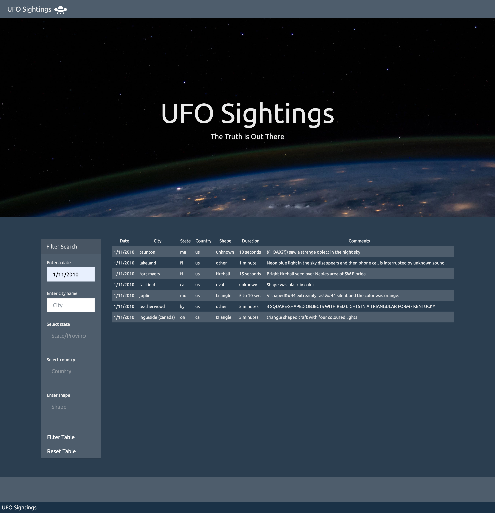

# Assignment 14: JavaScript and DOM Manipulation - SooBin
For this assignment, UFO sighting occurrences are collected and used for creating an interactive web-app that allows advanced search with multiple filters.

For codes, please refer to the following documents:
* `static/js/app.js` for constructing the main table; and
* `index.html` for the basic html source codes.

You can access the dashboard of the web-app by clicking [here](https://soobing91.github.io/Assignment_14_SooBin/index.html). Please use `Chrome` for the best experience.

The screenshot below depicts an example search on `Chrome`.

